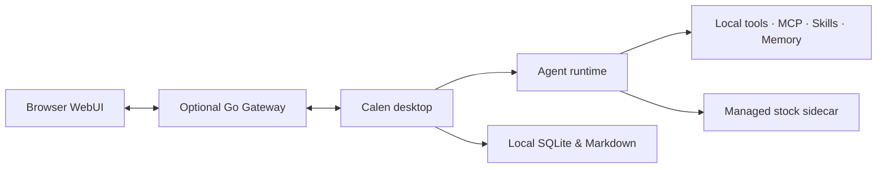

<p align="center">
  
</p>

<h1 align="center">Calen</h1>

<p align="center">
  A local-first desktop AI agent that does real work, extends through tools, and treats stock research as evidence.
</p>

<p align="center">
  English · <a href="README.zh-CN.md">简体中文</a>
</p>

<p align="center">
  <a href="https://github.com/MiaTxxx/Calen/releases/latest"></a>
  
  
  <a href="LICENSE"></a>
</p>

<p align="center">
  <a href="https://github.com/MiaTxxx/Calen/releases/latest">Download</a> ·
  <a href="docs/README.md">Documentation</a> ·
  <a href="https://github.com/MiaTxxx/Calen/issues">Issues</a>
</p>

---

## What Calen is

Calen puts an AI agent inside a working desktop environment. Within the permissions you grant, it inspects projects, edits files, runs commands, connects MCP servers and Skills, keeps long-lived context, and carries longer tasks to completion.

The desktop app is the product and the source of truth for local data and tool execution. An optional **Gateway** lets a browser reach a _running_ desktop agent — tools and storage stay on the desktop, but chat, history, settings, and uploads then travel through the authenticated Gateway relay.

Calen also ships a self-contained stock-research domain. Quotes, filings, portfolios, and experimental quant results always carry their source and freshness; they are never presented as facts the model may invent.

## Core capabilities

| Area            | What Calen provides                                                                                  |
| --------------- | ---------------------------------------------------------------------------------------------------- |
| Agent workspace | Streaming replies, multi-turn execution, model switching, long-context compaction, file context.     |
| Local tools     | File ops, search, shell, managed processes, uploads, scheduled tasks, Git, SSH, tunnels, sub-agents. |
| MCP & Skills    | External MCP servers and task-specific Skills with explicit enablement and runtime boundaries.       |
| Memory          | Durable project and cross-session context backed by local Markdown and SQLite.                       |
| Stock research  | Instruments, market views, watchlists, portfolios, indicators, strategies, reproducible backtests.   |
| Remote access   | An optional Go Gateway and browser WebUI onto a running desktop agent.                               |

Calen supports Claude, OpenAI/Codex, and Gemini-style provider flows, plus custom base URLs for compatible services. Provider credentials are stored by the desktop app and redacted from ordinary Gateway snapshots.

## Stock research

The stock workspace is research infrastructure, not an automated trading terminal.

- Search normalized instruments across A-shares, Hong Kong, US stocks, and ETFs, subject to provider coverage.
- Review quotes, daily charts, profiles, financial statements, holders, dividends, capital flow, news, and announcements.
- Keep local watchlists, portfolios, and transaction ledgers with CSV transfer, multi-currency summaries, and encrypted backups.
- Run experimental indicators, scorecards, strategies, evaluators, and causal backtests with benchmark, cost, drawdown, and coverage context.
- Provider routing, bounded caching, throttling, health checks, circuit breaking, and fallback are built in — missing data is never fabricated.

Every evidence result carries source, as-of time, retrieval time, cache state, and warnings; failures surface as `partial` or `unavailable`.

> Market data may be delayed, incomplete, or wrong. Calen does not place trades, guarantee returns, or give investment advice.

## Install on Windows

Get the current Windows x64 packages from [GitHub Releases](https://github.com/MiaTxxx/Calen/releases/latest).

| Package                                 | Use                                |
| --------------------------------------- | ---------------------------------- |
| `Calen-<version>-Windows-x64-Setup.exe` | Standard interactive installation. |
| `Calen-<version>-Windows-x64.msi`       | Managed / MSI-based deployment.    |

Windows 10/11 with WebView2 is required. Installers may warn about an unknown publisher when no Authenticode signature is present; updater artifacts are verified separately against Calen's bundled public key.

**First run:** open **Settings** → add a provider and select a model → choose a workspace before letting tools touch project files → enable only the Skills, MCP servers, and remote features you need → open **Stock Research** and check data-source health before relying on results.

## Architecture



- **Desktop UI** — React, TypeScript, Vite, Tailwind CSS (`crates/agent-gui/src`).
- **Desktop backend** — Tauri 2, Rust, Tokio, SQLite, gRPC (`crates/agent-gui/src-tauri`).
- **Agent runtime** — context construction, model streaming, tool execution, compaction, memory, Gateway events.
- **Stock sidecar** — a Calen-managed JSON-RPC-over-stdio process returning unified evidence (`crates/stock-sidecar`).
- **Gateway** — Go, gRPC, HTTP, WebSocket, and an embedded React WebUI (`crates/agent-gateway`).

See the [architecture overview](docs/architecture/overview.md) for process boundaries and data flows.

## Privacy and permission boundaries

- The desktop app owns local execution, durable history, memory, credentials, and project data; the Gateway is a bounded relay, not a second source of truth.
- Remote browser sessions use a restricted tool profile — they do not automatically inherit file, shell, memory, MCP, Skills, cron, SSH, tunnel, or sub-agent access.
- Model prompts go to the provider the user selects; stock requests go only to enabled data providers, each with its own terms, quotas, and coverage.
- AI reads a portfolio only when the current request explicitly asks for it, and never gets write access to assets.
- Use a strong token, TLS, and the narrowest practical network exposure when enabling remote access.

## Local development

**Requirements:** Node.js 24.17+, pnpm 10.32.1, Rust stable with the `x86_64-pc-windows-msvc` target, Visual Studio C++ Build Tools + Windows SDK, and Go 1.25.12 for Gateway work. The `Makefile` holds the canonical commands (`make help`).

```bash
git clone https://github.com/MiaTxxx/Calen.git
cd Calen
pnpm install
pnpm --dir crates/stock-sidecar install
pnpm --dir crates/agent-gui install
pnpm --dir crates/agent-gateway/web install

# Build the stock sidecar first (and whenever its source changes), then start the real app:
pnpm --dir crates/stock-sidecar build
make dev            # = pnpm --dir crates/agent-gui tauri dev
```

`pnpm --dir crates/agent-gui dev` starts only the browser frontend; it cannot validate Tauri IPC, SQLite, native attachments, window chrome, or packaged resources. Use `make dev` for anything touching the backend.

Run the shared checks before opening a PR or cutting a release:

```bash
pnpm typecheck
pnpm test
git diff --check
```

The latest user-facing changes are in the [release notes](docs/releases/). Sub-project commands live in [development and operations](docs/operations/development.md).

## Optional Gateway

The desktop app runs standalone. Deploy the Gateway only when a browser needs to reach a running desktop agent.

```bash
docker pull ghcr.io/miatxxx/calen-gateway:latest

docker run -d \
  --name calen-gateway \
  --restart unless-stopped \
  -p 50051:50051 \
  -p 50052:8080 \
  -e LIVEAGENT_GATEWAY_TOKEN=replace-with-a-strong-token \
  ghcr.io/miatxxx/calen-gateway:latest
```

`LIVEAGENT_GATEWAY_TOKEN` is a preserved compatibility variable; new settings prefer `CALEN_*` names where that does not break existing installs.

## Documentation

- [Documentation index](docs/README.md) · [Architecture overview](docs/architecture/overview.md) · [Chat runtime](docs/features/chat-runtime.md)
- [Tools](docs/features/tools.md) · [Skills and MCP](docs/features/skills-and-mcp.md) · [Protocols](docs/architecture/protocols.md)
- [Stock integration plan](docs/stock-integration-plan.md) · [Provider compliance review](docs/provider-compliance-review.md) · [Development and operations](docs/operations/development.md)

## Contributing

Focused issues and pull requests are welcome. Keep changes within the owning module, add tests in proportion to risk, and preserve compatibility identifiers unless you include a migration path. Do not commit provider keys, user data, signing keys, or private market data.

## License

Calen is released under the [MIT License](LICENSE), Copyright © 2026 Stack-Cairn.

Parts of the stock-research implementation derive from the Apache-2.0-licensed Opptrix project. Attribution and bundled-dependency notices are in [THIRD_PARTY_NOTICES.md](THIRD_PARTY_NOTICES.md); an open-source license is not a grant to redistribute third-party market data.
