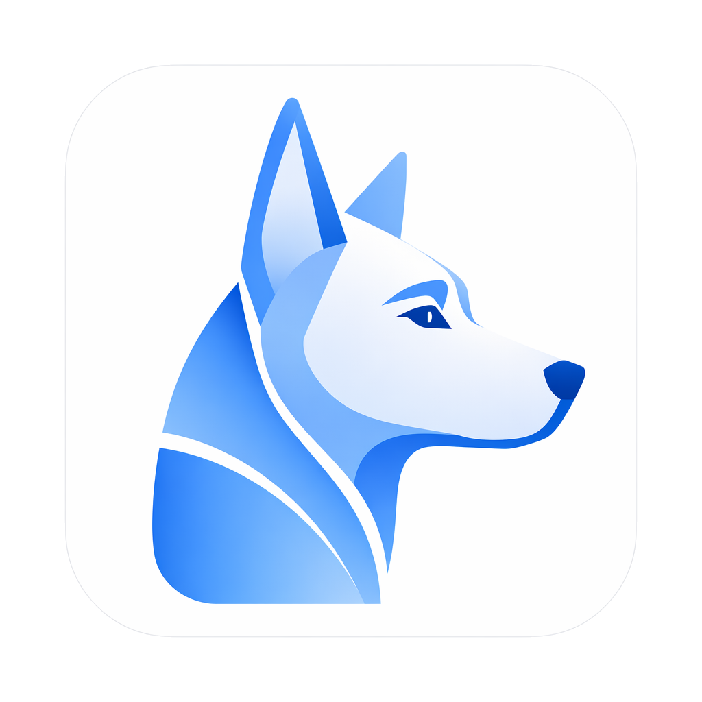

<p align="center">
  
</p>

<h1 align="center">Calen</h1>

<p align="center">
  A local-first desktop AI agent for project work, extensible automation, and evidence-aware stock research.
</p>

<p align="center">
  <a href="README.md">English</a> | <a href="README.zh-CN.md">Simplified Chinese</a>
</p>

<p align="center">
  <a href="https://github.com/MiaTxxx/Calen/releases/latest"></a>
  
  
  <a href="LICENSE"></a>
</p>

<p align="center">
  <a href="https://github.com/MiaTxxx/Calen/releases/latest">Download</a> |
  <a href="docs/README.md">Documentation</a> |
  <a href="https://github.com/MiaTxxx/Calen/issues">Issues</a>
</p>

---

## Why Calen

Calen is a desktop workspace where an AI agent can inspect a project, edit files, run commands, use tools, and continue long tasks. The desktop app remains the execution and storage authority.

The optional Gateway provides browser access to the same running desktop agent. It relays authenticated chat and settings traffic without turning the remote server into a second source of truth.

Calen is designed for workflows that need visible progress, recoverable state, explicit permissions, and inspectable evidence instead of a disposable chat window.

## Highlights in v1.1.6

This release focuses on conversation continuity, workspace density, provider management, and a clearer stock-research workspace.

- Unsent drafts persist per conversation, including rich text, large pastes, the working directory, and attachment references.
- A manual context reset keeps visible history while excluding earlier messages and summaries from the next model request.
- Chat width and composer height are resizable, persistent, responsive, and also available as presets in Settings.
- A controlled theme editor covers key application surfaces, light and dark palettes, font families, and independent area font scales.
- Provider setup now uses a wider two-column editor with model search, filters, stable ordering, status markers, and inline limits.
- Provider name and URL suggestions use application-managed history that can be paused, hidden, restored, or cleared without storing API keys.
- Recent conversations are grouped by date, optional AI titles are bounded by locale, and Windows shows indeterminate taskbar activity while agents run.
- The stock workspace is split into focused market, research, source, laboratory, and experimental analysis views.

See [the v1.1.6 release notes](docs/releases/v1.1.6.md) for the complete user-facing summary.

## Core capabilities

| Area            | What Calen provides                                                                                                                       |
| --------------- | ----------------------------------------------------------------------------------------------------------------------------------------- |
| Agent workspace | Streaming replies, text and tool modes, model switching, file context, long-context compaction, and queued follow-up turns.               |
| Local tools     | File operations, search, shell commands, managed processes, uploads, scheduled tasks, Git views, SSH, tunnels, and controlled sub-agents. |
| MCP and Skills  | External MCP servers and task-specific Skills with explicit enablement, validation, and runtime boundaries.                               |
| Memory          | Local Markdown and SQLite-backed memory for durable project and cross-session context.                                                    |
| Stock research  | Market views, evidence panels, watchlists, portfolios, financial research, indicators, strategies, and reproducible backtests.            |
| Remote access   | An optional Go Gateway and browser WebUI connected to a running desktop agent.                                                            |

### Supported model routes

Calen supports Claude, OpenAI/Codex, and Gemini provider flows. Custom base URLs and compatible request formats can be configured for services that implement the expected APIs.

Provider credentials are stored by the desktop application. API keys are never added to provider history and are redacted from ordinary Gateway settings snapshots.

### Conversation continuity

Draft persistence is enabled by default. Switching conversations, opening Settings, changing pages, or restarting the app no longer discards unfinished input.

Desktop drafts use a dedicated SQLite table. WebUI drafts use browser-local IndexedDB. Drafts remain device-local and are not synchronized through the Gateway.

The context reset command creates a durable `manual-reset` boundary. Earlier messages remain visible for reference, but the next turn starts without old messages or compressed summaries.

### Layout and appearance

The transcript and composer share one content width. Drag handles adjust width and composer height on pointer-based desktop layouts, while small screens fall back to the available width.

Settings provides narrow, standard, wide, and full-width presets. Exact width, composer height, controlled colors, fonts, and font scales can also be adjusted and restored.

Theme import accepts versioned JSON with strict color and numeric validation. It does not accept arbitrary CSS.

### Provider and model management

The provider editor separates endpoint credentials from model selection. Search, added-state filters, counts, stable server order, and an inline model inspector make large model catalogs manageable.

Recently saved provider names and base URLs are stored locally. Each provider type keeps up to 20 entries, while API keys are deliberately excluded.

## Stock research workspace

Calen treats stock features as research infrastructure, not as an automated trading terminal.

- Search normalized instruments across A-shares, Hong Kong stocks, US stocks, and ETFs when providers support them.
- Review quotes, daily charts, profiles, financial statements, holders, dividends, capital flow, news, and announcements.
- Maintain local watchlists, portfolios, transactions, CSV transfers, multi-currency summaries, and encrypted backups.
- Run experimental indicators, scorecards, strategies, evaluators, and causal backtests with benchmark and drawdown context.
- Inspect provider health, routing, cache state, throttling, warnings, and unavailable capabilities.

Every evidence result includes source metadata, an as-of time, retrieval time, cache state, and warnings. Missing data remains missing instead of being filled by the model.

> Market information may be delayed, incomplete, or incorrect. Calen does not place trades, guarantee returns, or provide investment advice.

## Privacy and permission boundaries

The desktop app owns local execution, durable history, memory, credentials, and project data. The Gateway is a relay and does not directly browse the desktop file system.

Remote browser sessions use a restricted tool profile. They do not automatically inherit unrestricted file, shell, memory, MCP, Skills, cron, SSH, tunnel, or sub-agent capabilities.

Remote uploads and selected chat, history, and settings traffic pass through the authenticated Gateway. Use a strong token, TLS, and the narrowest practical network exposure.

Model prompts are sent to the provider selected by the user. Stock requests are sent only to enabled data providers and retain their own terms, quotas, and coverage limits.

## Install on Windows

Download the current Windows x64 packages from [GitHub Releases](https://github.com/MiaTxxx/Calen/releases/latest).

| Package                              | Recommended use                               |
| ------------------------------------ | --------------------------------------------- |
| `Calen-vX.Y.Z-Windows-x64-Setup.exe` | Standard interactive installation.            |
| `Calen-vX.Y.Z-Windows-x64.msi`       | Managed deployment or MSI-based installation. |

Windows 10 or Windows 11 with WebView2 is required. Current installers may show an unknown-publisher warning when an Authenticode publisher signature is not available.

Updater artifacts are signed independently and verified against the public key bundled with Calen.

## First run

1. Install Calen and open **Settings**.
2. Add a provider, configure its endpoint and key, then select at least one model.
3. Choose a workspace before allowing tools to operate on project files.
4. Enable only the Skills, MCP servers, system tools, and remote features you need.
5. Open **Stock Research** to inspect data-source health before relying on market results.

## Local desktop development

### Requirements

- Node.js 24.17 or newer.
- pnpm 10.32.1.
- Rust stable with the `x86_64-pc-windows-msvc` target.
- Visual Studio C++ Build Tools and a Windows SDK.
- Go 1.25.12 for Gateway development.

### Install dependencies

```powershell
git clone https://github.com/MiaTxxx/Calen.git
cd Calen
pnpm install
pnpm --dir crates/stock-sidecar install
pnpm --dir crates/agent-gui install
pnpm --dir crates/agent-gateway/web install
```

### Start the desktop app

Build the stock sidecar on the first run and whenever its source changes. Tauri then starts the real desktop app, while Vite provides frontend hot reload.

```powershell
cd D:\Agent
pnpm --dir crates/stock-sidecar build
pnpm --dir crates/agent-gui tauri dev
```

Running only `pnpm --dir crates/agent-gui dev` starts the browser frontend. It cannot validate Tauri IPC, SQLite, native attachments, window chrome, taskbar state, or packaged resources.

## Build and verification

Run the shared checks before creating a release:

```powershell
pnpm typecheck
pnpm test
git diff --check
```

Build the stock sidecar and verify its bundled notices:

```powershell
pnpm --dir crates/stock-sidecar build
pnpm --dir crates/stock-sidecar verify:bundle
```

Build a local desktop package for the current platform:

```powershell
pnpm --dir crates/agent-gui tauri build
```

Official Windows releases use the repository's tagged GitHub Actions workflow. It stages the stock and translation runtimes, builds NSIS and MSI packages, signs updater artifacts, tests installation, and uploads the release assets.

## Architecture


| Layer           | Responsibility                                                                                 |
| --------------- | ---------------------------------------------------------------------------------------------- |
| Desktop UI      | React, TypeScript, Vite, chat surfaces, settings, tools, and research views.                   |
| Desktop backend | Tauri, Rust, SQLite, system commands, runtime services, and local persistence.                 |
| Agent runtime   | Context construction, model streaming, tool execution, compaction, memory, and Gateway events. |
| Stock sidecar   | A managed JSON-RPC stdio process that normalizes provider evidence and quantitative research.  |
| Gateway         | Go, gRPC, HTTP, WebSocket, authentication, bounded relay state, and the embedded WebUI.        |

Read the [architecture overview](docs/architecture/overview.md) for process boundaries, storage ownership, and data flows.

## Optional Gateway and WebUI

The desktop application works without a server. Deploy the Gateway only when browser-based access to a running desktop agent is required.

```bash
docker pull ghcr.io/miatxxx/calen-gateway:latest

docker run -d \
  --name calen-gateway \
  --restart unless-stopped \
  -p 50051:50051 \
  -p 50052:8080 \
  -e LIVEAGENT_GATEWAY_TOKEN=replace-with-a-strong-token \
  ghcr.io/miatxxx/calen-gateway:latest
```

`LIVEAGENT_GATEWAY_TOKEN` remains available for backward compatibility. New settings use `CALEN_*` names when that change does not break existing installations.

## Repository map

```text
crates/agent-gui/          Desktop React UI and Tauri backend
crates/agent-gateway/      Go Gateway service
crates/agent-gateway/web/  Browser WebUI
crates/stock-sidecar/      Stock research provider and quant runtime
docs/                      Architecture, feature, operation, and release docs
scripts/                   Release, validation, and maintenance scripts
```

## Documentation

- [Documentation index](docs/README.md)
- [Architecture overview](docs/architecture/overview.md)
- [Chat runtime](docs/features/chat-runtime.md)
- [Tools](docs/features/tools.md)
- [Skills and MCP](docs/features/skills-and-mcp.md)
- [Protocols](docs/architecture/protocols.md)
- [Development and operations](docs/operations/development.md)

## Contributing

Focused issues and pull requests are welcome. Keep changes within the owning module, add tests in proportion to risk, and preserve compatibility identifiers unless a migration path is included.

Do not commit provider keys, user data, signing keys, generated credentials, or private market data.

## License

Calen is released under the [MIT License](LICENSE), Copyright (c) 2026 Stack-Cairn.

Required notices for bundled open-source components are kept in [THIRD_PARTY_NOTICES.md](THIRD_PARTY_NOTICES.md). Component licenses do not grant rights to redistribute third-party market data.
