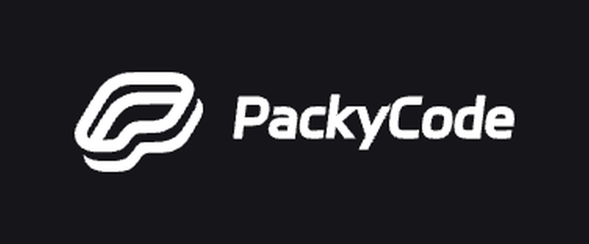
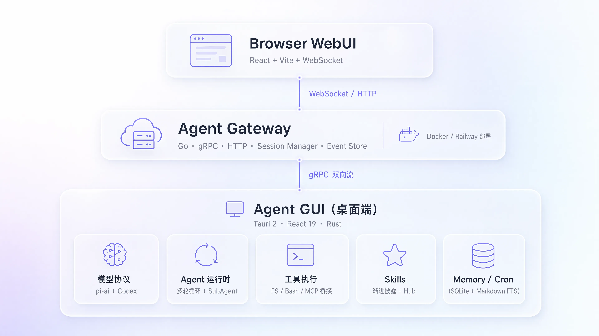

<h1 align="center">Calen</h1>

<p align="center">
  <strong>Your Local-First AI Agent Desktop</strong><br/>
  Multi-model access · Local tool execution · MCP & Skills ecosystem · Remote Gateway
</p>

<p align="center">
  English | <a href="README.zh-CN.md">简体中文</a>
</p>

<p align="center">
  
  
  
  
  
  
</p>

<p align="center">
  <a href="#core-features">Core Features</a> •
  <a href="#download--deployment">Download & Deployment</a> •
  <a href="#faq">FAQ</a> •
  <a href="docs/">Docs</a>
</p>

---

## 🌟 Special Thanks

<p align="center">
  <a href="https://linux.do">
    
  </a>
</p>
<p align="center"><b>学AI，上L站！祝小破站越来越好～</b></p>

---

## ❤️ Sponsor

<table>
<tr>
<td width="200" align="center" valign="middle"><a href="https://www.packyapi.com/register"></a></td>
<td valign="middle">PackyCode is a reliable, efficient, and professional API relay service provider, offering relay services for Claude Code, Codex, Gemini, Chinese domestic models, and more — a long-established, top-tier relay. <b>The vast majority of the model resources used to develop this software were provided by PackyCode — thank you, Laonong!</b> Register <a href="https://www.packyapi.com/register">here</a> to get started!</td>
</tr>
<tr>
<td width="200" align="center" valign="middle"><a href="https://www.right.codes/register"></a></td>
<td valign="middle">Right Code provides stable relay services for Claude Code, Codex, Gemini, Chinese domestic models, and more. Invoices are available upon top-up, and enterprise and team users receive dedicated one-on-one support. <b>The remaining model resources used to develop this software were provided by RightCode — thanks to the RC site owner and the support team!</b> Register <a href="https://www.right.codes/register">here</a> to get started!</td>
</tr>
</table>

---

## Why Calen?

Calen is a **local-first** AI agent desktop client. It deeply integrates large language model reasoning with local system tools, so the AI can genuinely operate your file system, run commands, and manage scheduled tasks — while the Gateway enables remote access and collaboration.

- **An agent that actually gets things done** — beyond chat: read and write files, make precise edits, run Bash, and supervise long-running processes
- **A fully open ecosystem** — bridge any external tool via the MCP protocol, and load Skills packages on demand
- **Local and remote, both** — the desktop app works fully standalone; deploy the Gateway and control it from any browser

---

## Core Features

### 🧠 Multi-Model & Chat

- **Multi-model routing** — Claude (Anthropic), Codex (OpenAI), and Gemini protocols, with custom Base URL support for third-party compatible services
- **Rich rendering** — streaming Markdown with built-in KaTeX math, Mermaid diagrams, and Monaco code preview
- **History compaction** — dual-layer Segment + Summary Checkpoint persistence keeps long conversations from losing context
- **Internationalization** — built-in i18n multi-language framework

### 🔧 Local Tool Execution

- **Full file-system capabilities** — precise `Read` / `Write` / `Edit` / `Delete`, plus `Glob` / `Grep` pattern and regex search
- **Bash & long-running processes** — non-interactive command execution (cwd / timeout), with `ManagedProcess` supervising dev servers and other resident tasks
- **Sub-agent delegation** — independent sub-agents execute in parallel with worktree isolation and automatic merging
- **Tunnel exposure** — `TunnelManager` exposes local services to the public internet in one click

### 🧩 MCP & Skills Ecosystem

- **MCP protocol bridging** — the Tauri side natively bridges any stdio / http MCP server for unlimited tool extension
- **Skills packages** — progressive disclosure and on-demand loading, with install / create / package support and the ClawHub ecosystem

### 💾 Memory & Automation

- **Persistent memory** — Markdown + SQLite FTS full-text search for cross-session knowledge management
- **Scheduled tasks** — bash / http / prompt cron job types, executed automatically in the background

### 📈 Stock Research

- **Native Calen stock hub** — five workspaces for research, markets, watchlists and portfolios, experiments, and data sources
- **Evidence-first research** — quotes, charts, financials, filings, news, and market briefs show their sources, as-of time, and missing-data warnings
- **Local portfolio ledger** — complete transactions, portfolio analysis, multi-currency summaries, CSV import/export, and encrypted backups
- **Experimental quant tools** — indicators, scorecards, strategy signals, evaluators, and reproducible backtests with coverage and limitation disclosures

### 🌐 Remote Gateway

- **Access from any browser** — Go + gRPC gateway with a WebUI for remotely controlling the local agent
- **Disconnect recovery** — a bounded seq window replays short outages, with desktop-side persistence as the safety net

---

## Download & Deployment

The first release containing the stock integration is Windows x64 only. Installers are built by GitHub Actions and signed for the Tauri updater — grab the latest version from [**GitHub Releases**](https://github.com/MiaTxxx/Calen/releases/latest).

### System Requirements

| Platform | Requirements                                                 |
| -------- | ------------------------------------------------------------ |
| Windows  | x64; requires the WebView2 runtime (bundled with Windows 11) |

### Windows

Pick an installation method from [Releases](https://github.com/MiaTxxx/Calen/releases/latest):

| Method       | File                                    | Best for                                 |
| ------------ | --------------------------------------- | ---------------------------------------- |
| Setup wizard | `Calen-<version>-Windows-x64-Setup.exe` | Most users                               |
| MSI package  | `Calen-<version>-Windows-x64.msi`       | Enterprise distribution / silent install |

> The first release does not include portable, Linux, or macOS installers. It also has no Authenticode code signature, so Windows may display an “Unknown publisher” warning. In-app updates still require a valid Tauri updater signature.

### Need Remote Access? Deploy the Gateway

The desktop app works out of the box and depends on no server. Deploy the Gateway only if you want to **control your local agent from a browser**.

**Note: when deployed behind an Nginx reverse proxy, set the Gateway address on the Settings → Remote page to the HTTPS URL and use port 443.**

```bash
# Pull the image (built by GitHub Actions, multi-arch: amd64 / arm64)
docker pull ghcr.io/miatxxx/calen-gateway:latest

# Run in the background (gRPC → host 50051 | HTTP/WebSocket → host 50052)
docker run -d \
  --name calen-gateway \
  --restart unless-stopped \
  -p 50051:50051 \
  -p 50052:8080 \
  -e LIVEAGENT_GATEWAY_TOKEN=your-token \
  ghcr.io/miatxxx/calen-gateway:latest
```

<details>
<summary><b>Nginx reverse proxy configuration</b> — reference for custom domains / TLS</summary>

> The Gateway serves two kinds of traffic:
>
> the desktop app's bidirectional gRPC stream (default 50051) and the browser's HTTP / WebSocket (default 50052).
>
> When exposing through Nginx, proxy them separately. Both gRPC and WebSocket are long-lived connections, so raise the timeouts:

```nginx
# GUI Remote: gRPC Authenticate + AgentConnect
location /liveagent.gateway.v1.AgentGateway/ {
    grpc_pass grpc://127.0.0.1:50051;

    grpc_set_header Host $host;
    grpc_set_header Authorization $http_authorization;
    grpc_set_header X-Forwarded-For $proxy_add_x_forwarded_for;
    grpc_set_header X-Forwarded-Proto $scheme;

    grpc_socket_keepalive on;
    grpc_read_timeout 24h;
    grpc_send_timeout 24h;
}

# WebUI WebSocket
location = /ws {
    proxy_pass http://127.0.0.1:50052;

    proxy_http_version 1.1;
    proxy_set_header Upgrade $http_upgrade;
    proxy_set_header Connection "upgrade";

    proxy_set_header Host $host;
    proxy_set_header Authorization $http_authorization;
    proxy_set_header X-Forwarded-For $proxy_add_x_forwarded_for;
    proxy_set_header X-Forwarded-Proto $scheme;

    proxy_read_timeout 24h;
    proxy_send_timeout 24h;
    proxy_buffering off;
}

# WebUI SPA/static/API
location / {
    proxy_pass http://127.0.0.1:50052;

    proxy_set_header Host $host;
    proxy_set_header Authorization $http_authorization;
    proxy_set_header X-Forwarded-For $proxy_add_x_forwarded_for;
    proxy_set_header X-Forwarded-Proto $scheme;

    proxy_read_timeout 10m;
    proxy_send_timeout 10m;
}
```

> Upstream ports map one-to-one to the host ports from the `docker run` above: gRPC 50051, HTTP/WebSocket 50052 (inside the container, HTTP actually listens on `PORT=8080`). The gRPC proxy requires Nginx to accept the desktop connection over HTTP/2 (`listen 443 ssl; http2 on;`).

</details>

### Build from Source

Expand the Development Guide below for the full set of Make commands.



<details>
<summary><b>Architecture Overview</b> — diagram & tech stack</summary>

```
┌──────────────────────────────────────────────────────────────┐
│                        Browser WebUI                          │
│              React + Vite + WebSocket + Gateway API           │
└────────────────────────────┬─────────────────────────────────┘
                             │ WebSocket / HTTP
┌────────────────────────────▼─────────────────────────────────┐
│                       Agent Gateway                           │
│         Go · gRPC · HTTP · Session Manager · Event Store     │
│               (Railway / Docker / self-hosted)                │
└────────────────────────────┬─────────────────────────────────┘
                             │ gRPC (bidirectional stream)
┌────────────────────────────▼─────────────────────────────────┐
│                        Agent GUI                              │
│                   Tauri 2 · React 19 · Rust                  │
├──────────┬────────────┬───────────┬────────────┬─────────────┤
│ Models   │ Runtime    │ Tools     │ Skills     │ Memory/Cron │
│ pi-ai    │ multi-turn │ FS/Bash/  │ progressive│ SQLite+MD   │
│ + Codex  │ + SubAgent │ MCP bridge│ + Hub      │ FTS index   │
└──────────┴────────────┴───────────┴────────────┴─────────────┘
```

**Tech Stack**

| Component                 | Technology                                                   |
| ------------------------- | ------------------------------------------------------------ |
| **Agent GUI** · Framework | Tauri 2 + React 19 + TypeScript 6                            |
| **Agent GUI** · Build     | Vite 8 + pnpm                                                |
| **Agent GUI** · Styling   | Tailwind CSS 4 + Radix UI                                    |
| **Agent GUI** · Rendering | streamdown + KaTeX + Mermaid + Monaco Editor                 |
| **Agent GUI** · Backend   | Rust + Tokio + SQLite (rusqlite) + gRPC (tonic)              |
| **Agent GUI** · LLM       | @earendil-works/pi-ai · @openai/codex-sdk · claude-agent-sdk |
| **Gateway** · Language    | Go 1.25                                                      |
| **Gateway** · Protocols   | gRPC + Protobuf + HTTP + WebSocket                           |
| **Gateway** · Web UI      | React + Vite + Tailwind CSS (embedded)                       |
| **Gateway** · Deployment  | Docker multi-stage · Railway CI/CD                           |

</details>

<details>
<summary><b>Development Guide</b> — common Make commands (run <code>make help</code> for the full list)</summary>

| Command                            | Description                             |
| ---------------------------------- | --------------------------------------- |
| `make dev`                         | Start the Tauri development environment |
| `make build`                       | Build the desktop app                   |
| `make dev-gateway`                 | Start the Gateway dev server            |
| `make dev-webui`                   | Start the WebUI dev server              |
| `make gateway-build`               | Build the Gateway binary                |
| `make gateway-docker-build`        | Build the Docker image                  |
| `make gateway-docker-smoke`        | Build + health check                    |
| `make desktop-build-macos-release` | macOS signed release build              |
| `make build-linux`                 | Linux amd64 gateway                     |
| `make build-linux-arm`             | Linux arm64 gateway                     |
| `make proto`                       | Regenerate Protobuf code                |
| `make clean`                       | Clean build artifacts                   |

</details>

<details>
<summary><b>Project Structure</b> — directory tree</summary>

```
Calen/
├── crates/
│   ├── agent-gui/                # Desktop client
│   │   ├── src/                  # React frontend
│   │   │   ├── components/       #   UI components
│   │   │   ├── lib/              #   Core logic (chat, tools, skills, memory)
│   │   │   ├── pages/            #   Pages (Chat, Settings)
│   │   │   ├── i18n/             #   Internationalization
│   │   │   └── prompt/           #   System prompt templates
│   │   └── src-tauri/            # Rust backend (Tauri)
│   │
│   └── agent-gateway/            # Go gateway service
│       ├── cmd/gateway/          #   Entry point
│       ├── internal/             #   Core implementation
│       ├── proto/v1/             #   Protobuf definitions
│       └── web/                  #   Embedded WebUI
│
├── docs/                         # Project docs
│   ├── architecture/             #   Architecture design
│   ├── features/                 #   Feature guides
│   └── operations/               #   Operations & deployment
│
├── scripts/release/              # Release automation
├── .github/workflows/            # CI/CD (CI + Desktop Release + Gateway Docker)
├── Dockerfile                    # Gateway container image
├── Makefile                      # Build commands
└── Cargo.toml                    # Rust workspace
```

</details>

---

## FAQ

<details>
<summary><b>Does my API key ever leave my machine?</b></summary>

No. Keys are stored locally on the desktop side only. The Gateway is a pure protocol relay — it never accesses the file system and never stores any credentials.

</details>

<details>
<summary><b>Do I have to deploy the Gateway?</b></summary>

No. The desktop client works standalone with all local capabilities; deploy the Gateway only when you need browser-based remote access to your local agent.

</details>

<details>
<summary><b>Which models are supported?</b></summary>

Claude (Anthropic), Codex (OpenAI), and Gemini protocols are built in, plus custom Base URL support for any compatible third-party service.

</details>

<details>
<summary><b>Will long conversations / disconnects lose context?</b></summary>

No. The desktop app persists the full history with Segment + Summary Checkpoints; the Gateway replays short disconnects through a bounded seq window and converges automatically after reconnecting.

</details>

---

## Contributing

Issues and pull requests are welcome! See the [Development Guide](docs/operations/development.md) for setting up a dev environment.

Before submitting a PR, make sure all of the following checks pass (they match the CI gates):

**Desktop client · `crates/agent-gui`**

1. Type check & build pass: `pnpm build`
2. Lint passes: `pnpm lint`
3. Frontend unit tests pass: `pnpm test:frontend` (also run `pnpm test:release` when touching release scripts)
4. Rust backend check passes: `cargo check --manifest-path crates/agent-gui/src-tauri/Cargo.toml --tests` (run from the repo root)

**Gateway · `crates/agent-gateway` (if changed)**

1. Go unit tests pass: `go test ./...`
2. WebUI build / lint / tests pass: `pnpm build && pnpm lint && pnpm test` (run in `web/`)
3. Regenerate and commit artifacts after proto changes: `make proto`

**Cross-frontend consistency**

- Mirrored files between GUI and WebUI must be byte-identical: `node scripts/check-mirror.mjs`
- Keep the diff clean (no trailing whitespace): `git diff --check`

---

## 👥 Contributors

Thanks to everyone who has contributed to Calen!

<a href="https://github.com/MiaTxxx/Calen/graphs/contributors">
  
</a>

---

## License

MIT © StackCairn
