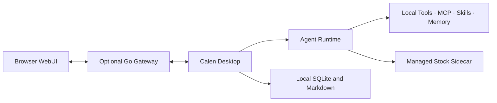

<p align="center">
  
</p>

<h1 align="center">Calen</h1>

<p align="center">
  A local-first desktop agent for real work, extensible tools, and evidence-based stock research.
</p>

<p align="center">
  English · <a href="README.zh-CN.md">简体中文</a>
</p>

<p align="center">
  <a href="https://github.com/MiaTxxx/Calen/releases/latest"></a>
  
  
  <a href="LICENSE"></a>
</p>

<p align="center">
  <a href="https://github.com/MiaTxxx/Calen/releases/latest">Download</a> ·
  <a href="docs/README.md">Documentation</a> ·
  <a href="https://github.com/MiaTxxx/Calen/issues">Issues</a>
</p>

---

## What Calen is

Calen brings an AI agent into a desktop workspace where it can do more than answer questions. It can work with local files, run commands, use MCP servers and Skills, keep durable context, manage scheduled tasks, and coordinate longer workflows.

The desktop app is the primary product and the local source of truth. The optional Gateway adds browser access while tool execution and durable storage stay on the desktop; authenticated chat, history, settings, and upload traffic is relayed through the Gateway when those remote features are used.

Calen also includes a dedicated stock-research domain. Market data, company information, filings, portfolio records, and experimental quantitative results are presented with source and freshness metadata instead of being treated as model-generated facts.

## Core experience

| Area            | What it provides                                                                                                           |
| --------------- | -------------------------------------------------------------------------------------------------------------------------- |
| Agent workspace | Streaming conversations, multi-turn execution, model switching, long-context compaction, code and document previews.       |
| Local tools     | File operations, search, shell commands, managed processes, uploads, scheduled tasks, and controlled sub-agent delegation. |
| MCP and Skills  | Connect external MCP servers and load task-specific Skills without expanding the core application into one monolith.       |
| Memory          | Local Markdown and SQLite-backed retrieval for durable project and cross-session context.                                  |
| Stock research  | Research, market briefs, watchlists, portfolios, transaction ledgers, indicators, strategies, and reproducible backtests.  |
| Remote access   | An optional Go Gateway and browser WebUI for reaching a running desktop agent from another device.                         |

### Models and compatible endpoints

Calen supports Claude, OpenAI/Codex, and Gemini-style provider flows, including configurable base URLs for compatible services. Provider credentials are persisted by the desktop application, and model requests are sent to the endpoint the user chooses.

### Tools that stay under your control

Local capabilities are executed by the desktop runtime. Remote browser sessions use a restricted tool profile and do not automatically inherit unrestricted file-system, shell, memory, MCP, Skills, cron, SSH, tunnel, or sub-agent access.

## Stock research

The stock workspace is designed as research infrastructure, not as an automated trading terminal.

- Search and normalized instruments for A-shares, Hong Kong stocks, US stocks, and ETFs, subject to provider coverage.
- Quotes, daily charts, company profiles, financial statements, shareholders, dividends, money flow, news, and notices when supported.
- Market briefs for active themes, market breadth, capital flow, unusual movement, and other provider-backed sections.
- Local watchlists, portfolios, transaction history, CSV import/export, multi-currency summaries, and encrypted backups.
- Experimental indicators, scorecards, strategy signals, evaluators, and causal backtests with benchmark, fees, drawdown, coverage, and limitations.
- Provider routing, bounded caching, throttling, health checks, circuit breaking, and fallback without inventing missing data.

Every evidence result carries source information, an as-of time, retrieval time, cache state, and warnings. Unsupported or failed capabilities return partial or unavailable results.

> Market information can be delayed, incomplete, or incorrect. Calen does not place trades, guarantee returns, or provide investment advice.

## Download for Windows

The current public desktop release is [Calen v1.1.0](https://github.com/MiaTxxx/Calen/releases/tag/v1.1.0) for Windows x64.

| Package                              | Recommended use                               |
| ------------------------------------ | --------------------------------------------- |
| `Calen-v1.1.0-Windows-x64-Setup.exe` | Standard interactive installation.            |
| `Calen-v1.1.0-Windows-x64.msi`       | Managed deployment or MSI-based installation. |

Windows 10/11 with WebView2 is required. The current binaries do not have an Authenticode publisher signature, so Windows may show an “Unknown publisher” warning. Application updates are independently verified with the Tauri updater signature.

No portable, Linux, or macOS installer is published for this release.

## First run

1. Install Calen from [GitHub Releases](https://github.com/MiaTxxx/Calen/releases/latest).
2. Add a model provider and test the configured endpoint.
3. Choose a workspace before allowing the agent to operate on project files.
4. Connect MCP servers or install Skills only when you need them.
5. Open **Stock Research** to search a security, inspect data-source status, or create a local portfolio.

Free stock providers can cover part of the first-run experience without a key. Optional providers have their own credentials, quotas, usage terms, and market coverage. Configure only services you are authorized to use.

## Architecture at a glance



- **Desktop UI:** React 19, TypeScript 7, Vite 8, Tailwind CSS 4.
- **Desktop backend:** Tauri 2, Rust, Tokio, SQLite, gRPC.
- **Stock service:** a managed JSON-RPC stdio sidecar with normalized provider evidence.
- **Gateway:** Go 1.25, gRPC, HTTP, WebSocket, and an embedded React WebUI.

Read the [architecture overview](docs/architecture/overview.md) for process boundaries and data flows.

## Run from source

### Requirements

- Node.js 24 and pnpm 10.32.1.
- Rust stable with the platform toolchain. Windows development requires MSVC Build Tools and the Windows SDK.
- Go 1.25.12 when building the Gateway.
- `make` for the repository shortcuts, or the equivalent package commands documented in each manifest.

### Desktop development

```bash
git clone https://github.com/MiaTxxx/Calen.git
cd Calen
pnpm install
pnpm --dir crates/stock-sidecar install
pnpm --dir crates/agent-gui install
pnpm --dir crates/agent-gateway/web install
make dev
```

### Verification

```bash
pnpm typecheck
pnpm test
git diff --check
```

See the [development guide](docs/operations/development.md) for component-specific commands and the [stock integration plan](docs/stock-integration-plan.md) for the stock-domain boundary.

## Optional Gateway

The desktop application works without a server. Deploy the Gateway only when you want browser-based remote access to a desktop agent that is already running.

```bash
docker pull ghcr.io/miatxxx/calen-gateway:latest

docker run -d \
  --name calen-gateway \
  --restart unless-stopped \
  -p 50051:50051 \
  -p 50052:8080 \
  -e LIVEAGENT_GATEWAY_TOKEN=replace-with-a-strong-token \
  ghcr.io/miatxxx/calen-gateway:latest
```

`LIVEAGENT_GATEWAY_TOKEN` is retained as a compatibility variable. New Calen-specific configuration uses `CALEN_*` names where migration safety allows it.

## Privacy and security boundaries

- Model and stock-provider credentials persist on the desktop and are redacted from ordinary Gateway settings snapshots.
- If a provider key is explicitly changed from the WebUI, the secret is relayed through the authenticated Gateway session to the desktop. Model and market-data requests also send the required credential to the configured provider endpoint.
- The Gateway does not directly browse the desktop file system or become the durable data source. Remote uploads and selected chat, history, and settings data do pass through the relay; persistent workspace, memory, portfolio, and transaction state remains on the desktop.
- Portfolio data is read by AI tools only for an explicit portfolio-analysis request; the AI tool surface does not receive asset write permissions.
- Stock failures and missing fields are surfaced as warnings instead of being filled by the model.
- Remote access should be protected with a strong token, TLS, and least-privilege network exposure.

## Documentation

- [Documentation index](docs/README.md)
- [Architecture overview](docs/architecture/overview.md)
- [Chat runtime](docs/features/chat-runtime.md)
- [Tools](docs/features/tools.md)
- [Skills and MCP](docs/features/skills-and-mcp.md)
- [Protocols](docs/architecture/protocols.md)
- [Stock integration plan](docs/stock-integration-plan.md)
- [Provider compliance review](docs/provider-compliance-review.md)
- [Development and operations](docs/operations/development.md)

## Contributing

Issues and focused pull requests are welcome. Keep changes inside the relevant Calen module, add tests in proportion to risk, and preserve compatibility identifiers unless a migration path is included.

Before opening a pull request, run:

```bash
pnpm typecheck
pnpm test
git diff --check
```

## License and third-party notices

Calen is released under the [MIT License](LICENSE), Copyright © 2026 Stack-Cairn.

Parts of the stock-research implementation are adapted from or informed by Opptrix under Apache-2.0. Required attribution and bundled dependency notices are documented in [THIRD_PARTY_NOTICES.md](THIRD_PARTY_NOTICES.md). Open-source licenses do not grant rights to redistribute third-party market data.
