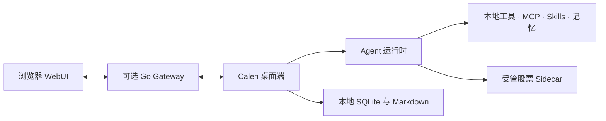

<p align="center">
  
</p>

<h1 align="center">Calen</h1>

<p align="center">
  一款本地优先的桌面 AI Agent：真正处理工作、通过工具自由扩展，并把股票研究当作证据来对待。
</p>

<p align="center">
  <a href="README.md">English</a> · 简体中文
</p>

<p align="center">
  <a href="https://github.com/MiaTxxx/Calen/releases/latest"></a>
  
  
  <a href="LICENSE"></a>
</p>

<p align="center">
  <a href="https://github.com/MiaTxxx/Calen/releases/latest">下载</a> ·
  <a href="docs/README.md">文档</a> ·
  <a href="https://github.com/MiaTxxx/Calen/issues">问题反馈</a>
</p>

---

## Calen 是什么

Calen 把 AI Agent 放进一个真正可工作的桌面环境。在你授予的权限范围内，它可以查看项目、编辑文件、执行命令、连接 MCP Server 与 Skills、保留长期上下文，并把较长的任务推进到完成。

桌面端是产品主体，也是本地数据与工具执行的真相源。可选的 **Gateway** 让浏览器访问一个*正在运行*的桌面 Agent——工具执行与持久化仍在桌面端，但启用后对话、历史、设置和上传会经过身份验证的 Gateway 中继。

Calen 还内置了独立的股票研究领域。行情、公告、组合记录和实验性量化结果都会携带来源与时效，绝不会被当作模型可以自由生成的事实。

## 核心能力

| 领域          | 能力                                                                      |
| ------------- | ------------------------------------------------------------------------- |
| Agent 工作区  | 流式对话、多轮执行、模型切换、长上下文压缩、文件上下文。                  |
| 本地工具      | 文件操作、搜索、Shell、进程托管、上传、定时任务、Git、SSH、隧道、子代理。 |
| MCP 与 Skills | 连接外部 MCP Server，按需加载任务型 Skills，边界与启用均需显式确认。      |
| 记忆          | 通过本地 Markdown 与 SQLite 保存项目知识和跨会话上下文。                  |
| 股票研究      | 标的、市场复盘、自选、组合、指标、策略与可复算回测。                      |
| 远程访问      | 通过可选的 Go Gateway 与浏览器 WebUI 访问正在运行的桌面 Agent。           |

Calen 支持 Claude、OpenAI/Codex 与 Gemini 风格的 Provider 流程，也支持为兼容服务配置自定义 Base URL。Provider 凭据由桌面应用持久化，并从普通 Gateway 快照中脱敏。

## 股票研究

股票工作区定位为研究基础设施，而非自动交易终端。

- 支持 A 股、港股、美股与 ETF 的标的搜索与统一标识，覆盖范围取决于数据源。
- 在数据源支持时提供行情、日 K、公司资料、财务三表、股东、分红、资金流、新闻与公告。
- 本地保存自选、组合与完整交易流水，支持 CSV 导入导出、多币种汇总与加密备份。
- 技术指标、评分卡、策略信号、Evaluator 与因果回测统一标记为实验性功能，并展示基准、费用、回撤与覆盖率。
- 内置 Provider 路由、有界缓存、限流、健康检查、熔断与自动回退——缺失数据绝不补造。

每个证据结果都包含来源、数据截至时间、获取时间、缓存状态和警告；调用失败会明确返回 `partial` 或 `unavailable`。

> 市场信息可能延迟、不完整或存在错误。Calen 不执行交易、不保证收益，也不构成投资建议。

## Windows 下载

从 [GitHub Releases](https://github.com/MiaTxxx/Calen/releases/latest) 获取当前 Windows x64 安装包。

| 安装包                                  | 适用场景                    |
| --------------------------------------- | --------------------------- |
| `Calen-<version>-Windows-x64-Setup.exe` | 普通用户交互式安装。        |
| `Calen-<version>-Windows-x64.msi`       | 企业分发或基于 MSI 的部署。 |

系统需要 Windows 10/11 与 WebView2。安装包在缺少 Authenticode 签名时可能提示“未知发布者”；应用更新会单独对照 Calen 内置公钥校验 updater 签名。

**第一次使用：** 打开**设置** → 添加 Provider 并选择模型 → 在允许工具操作项目文件前先选择工作目录 → 只启用你需要的 Skills、MCP Server 与远程功能 → 打开**股票研究**，先检查数据源状态再依赖结果。

## 架构概览



- **桌面 UI** —— React、TypeScript、Vite、Tailwind CSS（`crates/agent-gui/src`）。
- **桌面后端** —— Tauri 2、Rust、Tokio、SQLite、gRPC（`crates/agent-gui/src-tauri`）。
- **Agent 运行时** —— 上下文构建、模型流式、工具执行、压缩、记忆与 Gateway 事件。
- **股票 Sidecar** —— 由 Calen 管理、通过 JSON-RPC over stdio 返回统一证据的子进程（`crates/stock-sidecar`）。
- **Gateway** —— Go、gRPC、HTTP、WebSocket 与内嵌 React WebUI（`crates/agent-gateway`）。

完整进程边界与数据流见[总体架构](docs/architecture/overview.md)。

## 隐私与安全边界

- 桌面端拥有本地执行、持久历史、记忆、凭据与项目数据；Gateway 只是有界中继，不是第二真相源。
- 浏览器远程会话使用受限工具配置，不会自动获得文件、Shell、记忆、MCP、Skills、Cron、SSH、隧道或子代理权限。
- 模型请求发送到用户选择的 Provider；股票请求只发往已启用的数据源，各自有其条款、配额与覆盖范围。
- 只有当前请求明确要求时，AI 才会读取组合，且不获得资产写权限。
- 启用远程访问时请使用强 Token、TLS 和最小化的网络暴露范围。

## 从源码开发

**环境要求：** Node.js 24.17+、pnpm 10.32.1、带 `x86_64-pc-windows-msvc` 目标的 Rust stable、Visual Studio C++ Build Tools 与 Windows SDK；构建 Gateway 还需 Go 1.25.12。`Makefile` 是命令的权威来源（`make help`）。

```bash
git clone https://github.com/MiaTxxx/Calen.git
cd Calen
pnpm install
pnpm --dir crates/stock-sidecar install
pnpm --dir crates/agent-gui install
pnpm --dir crates/agent-gateway/web install

# 先构建股票 sidecar（其源码变更时也需重建），再启动真正的应用：
pnpm --dir crates/stock-sidecar build
make dev            # 等价于 pnpm --dir crates/agent-gui tauri dev
```

`pnpm --dir crates/agent-gui dev` 只启动浏览器前端，无法验证 Tauri IPC、SQLite、原生附件、窗口 chrome 或打包资源。凡涉及后端请用 `make dev`。

提交 PR 或发布前先跑通共享检查：

```bash
pnpm typecheck
pnpm test
git diff --check
```

最新的用户可见变更见[发布说明](docs/releases/)，子项目命令见[开发与运行](docs/operations/development.md)。

## 可选 Gateway

桌面应用可独立运行。只有当浏览器需要访问一个正在运行的桌面 Agent 时，才部署 Gateway。

```bash
docker pull ghcr.io/miatxxx/calen-gateway:latest

docker run -d \
  --name calen-gateway \
  --restart unless-stopped \
  -p 50051:50051 \
  -p 50052:8080 \
  -e LIVEAGENT_GATEWAY_TOKEN=replace-with-a-strong-token \
  ghcr.io/miatxxx/calen-gateway:latest
```

`LIVEAGENT_GATEWAY_TOKEN` 是保留的兼容变量；在不破坏既有安装的前提下，新配置优先使用 `CALEN_*` 名称。

## 文档导航

- [文档索引](docs/README.md) · [总体架构](docs/architecture/overview.md) · [对话运行时](docs/features/chat-runtime.md)
- [工具系统](docs/features/tools.md) · [Skills 与 MCP](docs/features/skills-and-mcp.md) · [协议边界](docs/architecture/protocols.md)
- [股票集成计划](docs/stock-integration-plan.md) · [Provider 合规审查](docs/provider-compliance-review.md) · [开发与运行](docs/operations/development.md)

## 参与贡献

欢迎提交 Issue 和边界清晰的 Pull Request。请把修改放在正确的模块中，按风险补充测试，并在没有迁移方案时保留现有兼容标识。不要提交 Provider Key、用户数据、签名私钥或私有市场数据。

## 许可证与第三方归属

Calen 使用 [MIT License](LICENSE) 发布，Copyright © 2026 Stack-Cairn。

股票研究实现的部分代码或设计来源于 Apache-2.0 许可的 Opptrix。归属与随附依赖声明见 [THIRD_PARTY_NOTICES.md](THIRD_PARTY_NOTICES.md)；开源许可证不等于第三方市场数据的再分发授权。
