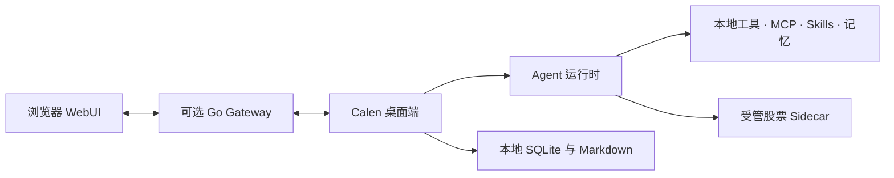

<p align="center">
  
</p>

<h1 align="center">Calen</h1>

<p align="center">
  一款本地优先的桌面 Agent：真正处理工作、自由扩展工具，并提供证据化股票研究。
</p>

<p align="center">
  <a href="README.md">English</a> · 简体中文
</p>

<p align="center">
  <a href="https://github.com/MiaTxxx/Calen/releases/latest"></a>
  
  
  <a href="LICENSE"></a>
</p>

<p align="center">
  <a href="https://github.com/MiaTxxx/Calen/releases/latest">下载</a> ·
  <a href="docs/README.md">文档</a> ·
  <a href="https://github.com/MiaTxxx/Calen/issues">问题反馈</a>
</p>

---

## Calen 是什么

Calen 把 AI Agent 放进一个真正可工作的桌面环境中。它不只回答问题，还可以在授权范围内处理本地文件、执行命令、连接 MCP Server 与 Skills、保留长期上下文、管理定时任务，并协作完成更长的工作流。

桌面端是产品主体，也是本地数据与工具执行的真相源。可选的 Gateway 用于从浏览器远程访问已经运行的桌面 Agent；工具执行和持久化存储仍在桌面端，但启用远程功能时，对话、历史、设置和文件上传流量会经过身份验证的 Gateway 中继。

Calen 还内置了独立的股票研究领域。行情、公司资料、公告、组合记录和实验性量化结果都会携带来源与时效信息，不会被当作模型可以自由生成的事实。

## 核心体验

| 领域          | 能力                                                                  |
| ------------- | --------------------------------------------------------------------- |
| Agent 工作区  | 流式对话、多轮执行、模型切换、长上下文压缩、代码与文档预览。          |
| 本地工具      | 文件操作、搜索、Shell、进程托管、文件导入、定时任务和受控子代理协作。 |
| MCP 与 Skills | 连接外部 MCP Server，按需加载任务型 Skills，保持核心应用边界清晰。    |
| 记忆          | 通过本地 Markdown 与 SQLite 检索保存项目知识和跨会话上下文。          |
| 股票研究      | 个股研究、市场复盘、自选、持仓、交易流水、指标、策略与可复算回测。    |
| 远程访问      | 通过可选的 Go Gateway 与浏览器 WebUI 访问正在运行的桌面 Agent。       |

### 模型与兼容服务

Calen 支持 Claude、OpenAI/Codex 与 Gemini 风格的 Provider 流程，也支持为兼容服务配置自定义 Base URL。Provider 凭据由桌面应用持久化，模型请求会发送到用户选择的对应服务端点。

### 工具权限仍由你控制

本地能力由桌面运行时执行。浏览器远程会话使用受限工具配置，不会自动获得无限制的文件系统、Shell、记忆、MCP、Skills、Cron、SSH、隧道或子代理权限。

## 股票研究

股票工作区定位为研究基础设施，不是自动交易终端。

- 支持 A 股、港股、美股和 ETF 的标的搜索与统一标识，具体覆盖范围取决于数据源。
- 在数据源支持时提供行情、日 K、公司资料、财务三表、股东、分红、资金流、新闻与公告。
- 提供市场热点、市场宽度、资金流、异动等由 Provider 数据支撑的盘前与盘后报告模块。
- 本地保存自选、组合和完整交易流水，支持 CSV 导入导出、多币种汇总与加密备份。
- 技术指标、评分卡、策略信号、Evaluator 与因果回测统一标记为实验性研究功能，并展示基准、费用、回撤、覆盖率和限制。
- 内置 Provider 路由、有界缓存、限流、健康检查、熔断和自动回退，不会补造缺失数据。

每个证据结果都包含来源、数据截至时间、获取时间、缓存状态和警告。能力不足或调用失败时，会明确返回 `partial` 或 `unavailable`。

> 市场信息可能延迟、不完整或存在错误。Calen 不执行交易、不保证收益，也不构成投资建议。

## Windows 下载

当前公开桌面版本为 [Calen v1.1.0](https://github.com/MiaTxxx/Calen/releases/tag/v1.1.0)，支持 Windows x64。

| 安装包                               | 适用场景                    |
| ------------------------------------ | --------------------------- |
| `Calen-v1.1.0-Windows-x64-Setup.exe` | 普通用户交互式安装。        |
| `Calen-v1.1.0-Windows-x64.msi`       | 企业分发或基于 MSI 的安装。 |

系统需要 Windows 10/11 与 WebView2。当前安装包没有 Authenticode 发布者签名，因此 Windows 可能提示“未知发布者”；应用更新会单独校验 Tauri updater 签名。

该版本不提供便携包、Linux 安装包或 macOS 安装包。

## 第一次使用

1. 从 [GitHub Releases](https://github.com/MiaTxxx/Calen/releases/latest) 安装 Calen。
2. 添加模型 Provider，并测试配置的服务端点。
3. 在允许 Agent 操作项目文件前，先选择明确的工作目录。
4. 只在需要时连接 MCP Server 或安装 Skills。
5. 打开“股票研究”，搜索证券、检查数据源状态，或创建本地投资组合。

部分免费股票数据源可在不填写 Key 的情况下覆盖基础体验。高级 Provider 各自具有凭据、配额、使用条款和市场范围，请只配置你有权使用的服务。

## 架构概览



- **桌面 UI：** React 19、TypeScript 7、Vite 8、Tailwind CSS 4。
- **桌面后端：** Tauri 2、Rust、Tokio、SQLite、gRPC。
- **股票服务：** 由 Calen 管理的 JSON-RPC stdio sidecar，对外返回统一证据结构。
- **Gateway：** Go 1.25、gRPC、HTTP、WebSocket 与内嵌 React WebUI。

完整进程边界与数据流请阅读[总体架构](docs/architecture/overview.md)。

## 从源码运行

### 环境要求

- Node.js 24 与 pnpm 10.32.1。
- Rust stable 与对应平台工具链；Windows 开发需要 MSVC Build Tools 和 Windows SDK。
- 构建 Gateway 时需要 Go 1.25.12。
- 仓库快捷命令使用 `make`；也可以按照各子项目 manifest 执行等价命令。

### 启动桌面开发环境

```bash
git clone https://github.com/MiaTxxx/Calen.git
cd Calen
pnpm install
pnpm --dir crates/stock-sidecar install
pnpm --dir crates/agent-gui install
pnpm --dir crates/agent-gateway/web install
make dev
```

### 验证

```bash
pnpm typecheck
pnpm test
git diff --check
```

子项目命令见[开发与运行](docs/operations/development.md)，股票领域边界见[股票集成计划](docs/stock-integration-plan.md)。

## 可选 Gateway

桌面应用可以独立运行。只有需要从浏览器远程访问已经启动的桌面 Agent 时，才需要部署 Gateway。

```bash
docker pull ghcr.io/miatxxx/calen-gateway:latest

docker run -d \
  --name calen-gateway \
  --restart unless-stopped \
  -p 50051:50051 \
  -p 50052:8080 \
  -e LIVEAGENT_GATEWAY_TOKEN=replace-with-a-strong-token \
  ghcr.io/miatxxx/calen-gateway:latest
```

`LIVEAGENT_GATEWAY_TOKEN` 是保留的兼容变量。不会破坏迁移安全的新配置会优先使用 `CALEN_*` 名称。

## 隐私与安全边界

- 模型和股票 Provider 凭据持久化在桌面端，并从普通 Gateway 设置快照中脱敏。
- 如果用户明确通过 WebUI 修改 Provider Key，密钥会经身份验证的 Gateway 会话中继到桌面端；调用模型或市场数据服务时，所需凭据也会发送到配置的 Provider 端点。
- Gateway 不会直接浏览桌面文件系统，也不是持久化数据源。远程上传以及部分对话、历史和设置数据会经过中继；工作区、记忆、组合与交易流水的持久化状态仍保留在桌面端。
- 只有用户明确发起组合分析时，AI 工具才会读取相关资产；AI 工具不获得资产写权限。
- 股票数据失败或字段缺失时会显示警告，不会让模型补齐。
- 远程访问应使用强 Token、TLS 和最小化的网络暴露范围。

## 文档导航

- [文档索引](docs/README.md)
- [总体架构](docs/architecture/overview.md)
- [对话运行时](docs/features/chat-runtime.md)
- [工具系统](docs/features/tools.md)
- [Skills 与 MCP](docs/features/skills-and-mcp.md)
- [协议边界](docs/architecture/protocols.md)
- [股票集成计划](docs/stock-integration-plan.md)
- [Provider 合规审查](docs/provider-compliance-review.md)
- [开发与运行](docs/operations/development.md)

## 参与贡献

欢迎提交 Issue 和边界清晰的 Pull Request。请把修改放在正确的 Calen 模块中，根据风险补充测试，并在没有迁移方案时保留现有兼容标识。

提交 PR 前请运行：

```bash
pnpm typecheck
pnpm test
git diff --check
```

## 许可证与第三方归属

Calen 使用 [MIT License](LICENSE) 发布，Copyright © 2026 Stack-Cairn。

股票研究实现的部分代码或设计来源于 Apache-2.0 许可的 Opptrix。完整归属和随附依赖声明见 [THIRD_PARTY_NOTICES.md](THIRD_PARTY_NOTICES.md)。开源代码许可证不等于第三方市场数据的再分发授权。
